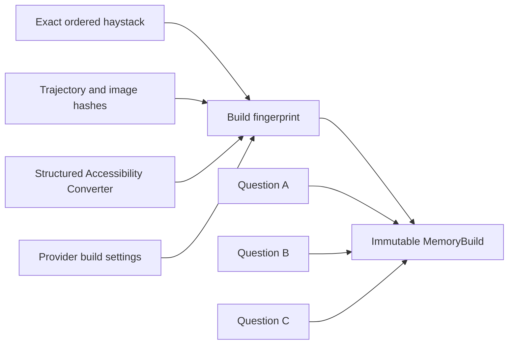
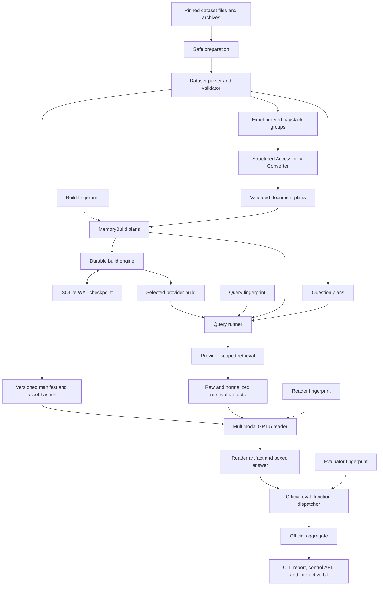

# LongMemEval-V2 in MemoryBench

Status: implementation complete on the `migration` branch. Local validation,
synthetic live Supermemory preflight, a real one-trajectory canary, and one real
complete-haystack GPT-5-high question pass. The user explicitly approved the
required data egress. The measured selected-question result is documented
below; it is not presented as a complete benchmark score.

## 1. Decision and naming

MemoryBench is the benchmark control plane. The UI can select Supermemory,
Filesystem, or local RAG as the live memory provider. LongMemEval-V2 owns its
dataset rules, reader prompt, answer parser, evaluator, and official
aggregation. Mem0 and Zep are visible as Plan-only choices until their remote
APIs can prove exact interrupted-ingestion reconciliation and cleanup.

Only one conversion strategy is in scope:

> **Structured Accessibility Converter**

This is the new name for the former `Approach_1.py` behavior. “Parser” is not a
good name for it because parsing and conversion are different jobs:

- The **dataset parser** reads JSONL, validates records, resolves haystacks, and
  creates typed trajectory objects.
- The **Structured Accessibility Converter** turns one typed trajectory into a
  deterministic set of provider-ready documents.

There are no numbered approaches in this integration.

## 2. What a MemoryBuild is

A **MemoryBuild** is an immutable, reusable memory corpus made from:

- one exact, ordered haystack;
- the byte hashes of its trajectories and screenshots;
- one converter name, version, and source hash;
- one provider and its content-changing build settings.

Questions do not own memory ingestion. They reference a `buildId`.

For example, all small-tier web questions share the same exact web haystack, so
MemoryBench ingests that haystack once and reuses its MemoryBuild. Small tier
therefore produces two builds: one web build and one enterprise build.

Changing `topK`, the reader, or the evaluator does not rebuild memory. Changing
the haystack, trajectory bytes, screenshot bytes, converter, or provider build
settings produces a different build fingerprint and therefore a different
MemoryBuild.



## 3. Frozen source and branch state

The implementation is grounded in these exact references:

| Item | Frozen value |
| --- | --- |
| MemoryBench base | `origin/main` at `118209a746d97d0d85e5a7234267f0b6962857e9` |
| Working branch | `migration`, created from that exact main commit |
| LongMemEval-V2 adapter oracle | `feat/supermemory` at `2fa6616dce77e0385d7e1c44510dfde8aa3c46e3` |
| Dataset repository | `xiaowu0162/longmemeval-v2` |
| Dataset revision | `f152293e235517d504809563c833d7190b8c713b` |
| Converter oracle | `supermemory_adapter/approaches/Approach_1.py` |
| Converter oracle SHA-256 | `22cff05fafa9f882040afa8296439da0f911f800c107424de105ab3af5e69236` |

MemoryBench `main` and `origin/main` were verified equal before the branch was
created. The LongMemEval-V2 checkout has an unrelated local change in
`evaluation/harness.py`; the implementation did not edit or use that local
change as source evidence.

The dataset and upstream benchmark are Apache-2.0 licensed. Attribution is in
[`THIRD_PARTY_NOTICES.md`](../THIRD_PARTY_NOTICES.md), and the downloader now
includes the dataset's checksum-verified `LICENSE` file.

## 4. Before and after

### LongMemEval-V2 `feat/supermemory`

The reference fork had the needed benchmark behavior, but it was a specialized
Python execution path:

- question data and haystacks were loaded by the benchmark harness;
- each trajectory was converted into structured documents;
- Supermemory V3 batch ingestion used deterministic custom IDs, metadata,
  `filterByMetadata`, and `dreaming: instant`;
- SQLite checkpoints tracked ingestion and resume;
- upload, polling, and question work used bounded concurrency;
- retrieval used Supermemory V4 and added retrieved screenshots to the reader;
- the reader produced boxed answers;
- `eval_function` selected deterministic or strict LLM grading;
- scripts supported preflight, dry run, canary, resume, and inspection.

Important problems found during the audit were container-only retrieval
isolation, question-centric repeated work, weak separation of cache identities,
path-only media identity in places, and no generic MemoryBench representation
for a shared reusable memory corpus.

### MemoryBench `origin/main`

The baseline framework already had providers, benchmarks, judges, a staged
orchestrator, checkpoint JSON, reports, a server, and a UI. Its main execution
model was:

```text
question -> sessions -> ingest -> search -> generic answer -> generic judge
```

That model was not enough for LongMemEval-V2 because the benchmark needs shared
haystacks, multimodal evidence, durable remote-document reconciliation, and
official benchmark-owned evaluation.

### MemoryBench `migration`

The migration adds a separate build-aware path without rewriting the existing
benchmark path:

```text
dataset snapshot
  -> parser and validator
  -> exact haystack grouping
  -> Structured Accessibility Converter
  -> reusable MemoryBuild
  -> filtered retrieval
  -> multimodal GPT-5 reader
  -> official LongMemEval-V2 evaluator
  -> official report plus diagnostics
```

All existing providers now declare capabilities. Unsupported build-aware
features fail before remote work begins. Supermemory, Filesystem, and RAG have
V2 `BuildProvider` adapters; Mem0 and Zep remain Plan-only.

## 5. End-to-end architecture



## 6. Dataset ingestion and preparation

### Download

`source.ts` and `download.ts` pin the revision, core-file hashes and sizes, 29
question-image hashes, two archive hashes and sizes, the checksum manifest, and
the Apache-2.0 dataset license.

Downloads are streamed into a private staging directory. A file is published
only after its size and SHA-256 match. The complete dataset directory is renamed
atomically. Concurrent operations use an owner lock. A dead same-root lock can
be recovered; a live or unreadable lock is rejected.

An existing incomplete dataset root is never overwritten. This protects local
operator files and makes partial failures visible.

### Screenshot preparation

`prepare.ts`:

- verifies both archive hashes before extraction;
- lists every tar entry first;
- rejects absolute paths, traversal, links, and special files;
- extracts into temporary directories;
- validates that extracted files remain under the destination;
- creates one common `screenshots/` view using relative symlinks, with a copy
  fallback where symlinks are not supported;
- validates all 48,609 referenced state screenshots before publishing;
- refuses to overwrite an incomplete existing screenshot view.

### Parser and manifest

`dataset.ts` parses and validates the pinned snapshot:

| Property | Audited value |
| --- | ---: |
| Questions | 451 |
| Trajectories | 1,870 |
| Trajectory states | 48,609 |
| Question images | 29 |
| Total used image assets | 48,638 |
| Unique small-tier builds | 2 |
| Unique medium-tier builds | 447 |

The parser validates IDs, domains, haystack membership, duplicate trajectory
references, cross-domain builds, `eval_function`, question order, and image
magic bytes. Asset paths are resolved through real paths and cannot escape the
dataset root. Every used image receives a stable SHA-256, MIME type, and byte
length.

Selection is deterministic. Exact IDs, prefix limits, per-category sampling,
domain filters, and seeded replay are supported. The complete ordered haystack
is always used for an official selected question.

## 7. Structured Accessibility Converter

The converter receives only a typed trajectory. Question text, answer, and
ground truth are not in its function signature, so they cannot leak into
ingested memory.

For a trajectory with `N` states it produces exactly `N + 2` independent
documents:

1. one trajectory overview;
2. one document for every state, in state-index order;
3. one trajectory result/outcome document.

Each state document contains structured visible evidence such as page titles,
landmarks, alerts, headings, controls, checkbox/radio state, options, tables,
and retained unparsed evidence. HTML entities, Unicode private-use characters,
spacing, repeated labels, table rows, and empty values are normalized
deterministically. The TypeScript cleaner is byte-equivalent to the Python
oracle on every state in the pinned dataset. It is not presented as a
general-purpose HTML5 decoder or full Unicode case-folding library: an
unobserved named entity or unusual case-fold character in a future dataset
revision must be treated as converter drift, covered by the source hash and
revalidated against the oracle before that revision is accepted.

The plan is one independent V3 batch per trajectory. It has no previous-
trajectory dependency and no external entity context. Every state document
carries its screenshot reference and state/step provenance.

The generic plan validator rejects:

- empty plans or content;
- duplicate logical IDs;
- accidental duplicate content;
- missing attachments or screenshots;
- invalid or reserved metadata;
- missing dependencies, self-dependencies, and cycles;
- nondeterministic converter output;
- a batch document that would require splitting.

Physical remote IDs are deterministic functions of build fingerprint,
trajectory ID, document ordinal, and part index.

## 8. Durable MemoryBuild ingestion

Each build has:

```text
data/memory-builds-v2/<provider>/<buildFingerprint>/
  plan.json
  checkpoint.sqlite
  summary.json
```

The SQLite database uses WAL, `synchronous=FULL`, foreign keys, and a busy
timeout. It records builds, ordered trajectories, every physical document,
attempt counts, leases, remote IDs, states, errors, and events.

The document lifecycle is:

```text
planned -> submitting -> accepted -> indexing -> ready
              |                         |
              +---- reconcile ----------+
                        |
                  retryable / failed
```

Before a retry, ambiguous state is reconciled by deterministic `customId`.
This covers a process dying before submission, a response being lost after
remote success, a 409 conflict, or a local commit not happening after a
successful remote request.

A build becomes ready only when every required trajectory and document is
ready. Partial indexing can never silently become a completed build. Reused
ready builds receive a remote health check before query.

Readiness polling is finite. The default LongMemEval-V2 CLI gives each
trajectory a 30-minute indexing deadline and four non-timeout attempts. If the
deadline expires, the engine deletes the exact unresolved deterministic IDs,
marks those documents and their trajectory as skipped, and makes the build
`degraded`. The remaining benchmark work may continue, but its report is
automatically `officiallyComparable: false`. Exact cleanup must succeed; an
unverified remote document is never silently ignored. `--strict-ingestion`
instead stops the run at the same bounded deadline.

`--force-build` first deletes only the exact enumerated documents whose remote
metadata proves they belong to the build, then resets the local checkpoint.
There is no container-wide destructive cleanup.

## 9. Provider behavior

| Provider | Live V2 stages | Durable resume and exact cleanup | Retrieval profile |
| --- | --- | --- | --- |
| Supermemory | Build through report | Remote custom-ID reconciliation, exact deletion, preflight gate | Hybrid, reranking on |
| Filesystem | Build through report | Atomic memory files plus exact metadata sidecars | Memory text matching, reranking off |
| Local RAG | Build through report | Per-container SQLite/WAL with atomic session replacement | Hybrid BM25/vector, reranking off |
| Mem0 | Plan only | Not yet proven for async event reconciliation and individual cleanup | Memories |
| Zep | Plan only | Not yet proven for episode provenance and individual cleanup | Memories |

Filesystem and RAG use the existing MemoryBench extraction behavior, including
`gpt-4o-mini`; this extraction configuration is part of the build fingerprint.
RAG persists embeddings and chunks transactionally, removes stale chunks on a
session retry, and uses deterministic score tie-breaking. Both local adapters
require exactly one contributing custom ID before attaching a screenshot to a
retrieval result. Their OpenAI extraction/embedding calls receive an abort
signal and are bounded by the configured per-trajectory deadline.

Mem0 and Zep are deliberately not advertised as live adapters. Their existing
legacy paths use asynchronous generated identities and cannot yet guarantee
that a timed-out remote job will never appear later or that one failed document
can be removed without disturbing the rest of the build. This prevents an
infinite wait without pretending that an unsafe degraded build is comparable.

### Supermemory reference adapter

The advanced provider supports:

- custom base URLs;
- V3 single and batch document operations;
- deterministic `customId`;
- metadata and `filterByMetadata`;
- `dreaming: instant`;
- status reconciliation and readiness polling;
- V4 hybrid or memories search;
- reranking and query rewriting capability declarations;
- exact cleanup and remote health verification.

Every remote document carries:

```text
benchmark
buildId
buildFingerprint
runFingerprint
tier
domain
haystackHash
trajectoryId
trajectoryOrder
documentType
documentOrdinal
partIndex / partCount
contentHash
causalKey
stateIndex / step
screenshot path / asset ID / SHA-256 / MIME / byte length
```

Requests share one adaptive request budget. A 429 or retryable server error
reduces concurrency. `Retry-After` is honored. Sustained success recovers the
budget gradually. Secrets are redacted from errors and artifacts.

An expensive build cannot start from CLI or the real advanced provider until a
passing preflight gate exists. The gate is scoped by normalized service URL,
must be fresh (24 hours by default), and must have tested at least the run's
configured top-K. Its report fingerprint, generation time, service URL, and
tested top-K are persisted in the run checkpoint. Missing, stale, mismatched,
or insufficient gates fail before the first dataset upload.

## 10. Retrieval, top-K, and screenshots

There is one authoritative retrieval `topK`. The reader has a separate
`evidenceTopK`, which must be less than or equal to retrieval `topK`.

Every V4 search uses both:

- the exact `containerTag`; and
- a mandatory logical metadata filter:

```json
{
  "AND": [
    {
      "key": "runFingerprint",
      "value": "<build fingerprint>",
      "filterType": "metadata"
    }
  ]
}
```

Extra filters are nested under that mandatory build boundary. A caller cannot
override the fingerprint. Invalid keys, types, numeric operands, and filters
nested deeper than the provider contract are rejected before search.

Returned result and document metadata are checked again. A result with missing
or mismatched provenance fails the question instead of entering the reader.
Provider results above configured `topK` are rejected.

Normalization preserves rank, score, memory text, summaries, chunks, document
IDs, trajectory/state provenance, and raw results. Duplicate chunks are removed
by content hash while first occurrence order is retained.

Screenshots are not uploaded as Supermemory media. Their content identity is
stored in document metadata. When search returns a screenshot reference,
MemoryBench matches all of its path, asset ID, hash, MIME type, and byte length
against the selected MemoryBuild. The reader then loads the verified local
bytes and places the image immediately after that evidence unit.

Raw request/response and normalized artifacts are immutable. A cache record is
accepted only if its identity, linked artifact hashes, normalized contents,
provenance, and result count all validate. Cached queries retain the original
remote duration but receive a new wall duration and `cacheHit: true`; reports do
not count cached remote time as a new live measurement.

## 11. Reader and evaluation

The reader uses benchmark-owned web or enterprise system prompts. Default
production settings are GPT-5 with high reasoning, a 200,000-token context
budget, and 20,000 maximum completion tokens.

Context order is:

```text
memory heading
retrieval rank 1 text
retrieval rank 1 verified screenshots
retrieval rank 2 text
retrieval rank 2 verified screenshots
...
question text
question image, when present
```

The conservative GPT-5 budget uses `o200k_base` for text and an explicit image
token allowance. Evidence units are removed from the end until the request
fits. The question and its image are never silently removed. Images also have
count and byte-size limits.

The reader artifact stores the full typed request parts, exact sent asset IDs,
omission count, model settings, response, usage, raw attempts, parsed answer,
duration, and cache status. Image byte hashes participate in reader identity.

Boxed-answer parsing uses the final `\boxed{...}` expression and supports nested
braces. A response without a box falls back to trimmed response text.

`eval_function` is parsed and dispatched by LongMemEval-V2 code, not the generic
MemoryBench judge. Implemented official paths are:

- normalized phrase-set match;
- ordered phrase-set match;
- single-choice match;
- multi-choice match;
- strict abstention judge;
- strict gotcha judge.

Every evaluator specification present in all 451 questions is validated. LLM
judge artifacts preserve request, raw response, parsed binary verdict, and
rationale. Evaluator failures are saved separately. Failed or blocked questions
remain in the official full-set denominator.

Official accuracy and category/abstention aggregates are a separate namespace
from MemoryBench diagnostics such as cache hits, search latency, and images
sent.

## 12. Fingerprints and reuse

| Identity | Includes | A change reruns |
| --- | --- | --- |
| Build | dataset and asset hashes, ordered trajectories, converter, document plans, provider build settings | ingestion |
| Query | build, question text/image hash, top-K, threshold, search mode, reranker, rewrite, metadata filters, normalizer | search |
| Reader | normalized retrieval, model/settings, prompt version, image hashes, budget algorithm | answer generation |
| Evaluator | answer, ground truth, exact `eval_function`, model/settings, prompt and implementation versions | grading |

This dependency split allows experiment changes without unnecessary remote
ingestion.

## 13. Concurrency and resume

There are four bounded concurrency layers:

- build concurrency: different unique MemoryBuilds;
- trajectory concurrency: trajectories inside a build;
- maximum provider requests in flight;
- question concurrency: query/read/evaluate work.

All Supermemory operations still pass through the shared adaptive request
budget, so multiplying worker counts cannot bypass the account-level cap.

Trajectory workers use renewable leases. Another worker cannot claim active
work; an expired lease can be recovered after a crash. Run checkpoint writes
are serialized and atomic. Resume reloads the same configuration, dataset
selection, question-to-build links, document plan, query artifact, reader
artifact, and evaluation artifact.

Changing semantic configuration under the same run ID is rejected. The
machine-local dataset path is excluded from semantic identity so a moved but
byte-identical dataset can resume.

## 14. CLI workflow

```bash
# Inspect all commands.
bun run src/index.ts lme-v2 --help

# Download and verify the pinned snapshot.
bun run src/index.ts lme-v2 download \
  --dataset data/benchmarks/longmemeval-v2

# Safely prepare the common screenshot view.
bun run src/index.ts lme-v2 prepare \
  --dataset data/benchmarks/longmemeval-v2

# Validate data, selection, assets, conversion, and cost shape without network.
bun run src/index.ts lme-v2 dry-run \
  --run-id lme-v2-dry-run \
  --dataset data/benchmarks/longmemeval-v2

# Probe the current Supermemory V3/V4 contract with synthetic records.
bun run src/index.ts lme-v2 preflight \
  --run-id lme-v2-preflight \
  --top-k 20

# Non-official, exactly one trajectory; build and query only.
bun run src/index.ts lme-v2 canary \
  --run-id lme-v2-canary \
  --dataset data/benchmarks/longmemeval-v2 \
  --question-id <id>

# Official selected-question run. Its complete exact haystack is always used.
bun run src/index.ts lme-v2 run \
  --run-id lme-v2-selected \
  --dataset data/benchmarks/longmemeval-v2 \
  --question-id <id> \
  --reader-model gpt-5 \
  --reasoning-effort high \
  --indexing-timeout-ms 300000 \
  --max-trajectory-attempts 2

# Resume or inspect without changing semantic configuration.
bun run src/index.ts lme-v2 resume --run-id lme-v2-selected
bun run src/index.ts lme-v2 inspect --run-id lme-v2-selected
```

Other actions are `build`, `query`, and `evaluate`. Medium tier is rejected
unless `--allow-medium` is explicit. A one-trajectory canary is prevented from
reading, evaluating, or reporting an official score.

`--preflight-max-age-hours` controls the maximum gate age for later build
commands. A successful preflight writes a service-scoped latest-passing gate;
a failed preflight never replaces it.

Ingestion is bounded. `--indexing-timeout-ms` is a hard per-trajectory
readiness deadline, and `--max-trajectory-attempts` bounds non-timeout retries.
By default, documents still unresolved at the indexing deadline are deleted by
their exact deterministic IDs, recorded as skipped, and the run continues with
a `degraded` build. A degraded run is visibly marked `officiallyComparable:
false`; its score is diagnostic and cannot satisfy a parity gate. Pass
`--strict-ingestion` when any skipped document should fail the whole run
instead.

## 15. Artifacts and inspection

Run artifacts are under `data/runs-v2/<runId>/`:

```text
checkpoint.json
dataset-manifest.json
selection.json
preflight.json               # when run with the same preflight run ID
builds/<buildId>.plan.json
report.json
```

The reusable live-service gate is stored separately under:

```text
data/preflights-v2/supermemory/<service-url-hash>/latest-passed.json
```

Reusable content-addressed artifacts are under `data/artifacts-v2/`:

```text
queries/<question>/<queryFingerprint>/
readers/<question>/<readerFingerprint>.json
evaluations/<question>/<evaluatorFingerprint>.json
assets/<sha256>.<extension>
```

All artifact writes are immutable, atomic, path-contained, and secret-redacted.
Symlink escapes and hash mismatches are rejected.

The server exposes a dedicated LongMemEval-V2 control API and safe inspection
routes. LongMemEval-V2 appears in the normal Benchmark dropdown. Its guided
form has a provider dropdown, complete-haystack selection, separate reader and
evaluator model choices, and an Advanced section for all four concurrency
limits, retry bounds, timeout behavior, force rebuild, and fresh retrieval. The
UI can create plan, build, retrieval, evaluation, or report runs;
stop an active run; resume the exact durable checkpoint target; and explicitly
continue a completed intermediate stage. It defaults to offline Plan and needs
an explicit confirmation before any unselected full-scope live run, including
every later resume or continuation beyond Plan. The UI can also run the bounded
synthetic Supermemory preflight with the server-side key; one preflight may run
at a time and its status is polled for at most eight minutes in the page.

LongMemEval-V2 is selected from the normal Benchmark dropdown. Its guided form
keeps dataset scope, exact-haystack count, reader/evaluator models, and stopping
point visible; paths, reasoning effort, retrieval depth, concurrency, retry
bounds, timeouts, and cache controls stay under Setup or Advanced. A
`haystackLimit` keeps the first N exact builds in pinned question order and all
questions linked to those builds. It never truncates a haystack's ordered
trajectory list. The pinned counts shown by the UI are small: 2 total (1 web,
1 enterprise), 100 trajectories each; medium: 447 total (236 web, 211
enterprise).

Run and question pages show build identity/reuse, stage and lifecycle history,
paginated question summaries, raw/normalized/reader/evaluation artifacts,
retrieval provenance, the exact answer, official evaluator verdict, and the
separate official-versus-diagnostic namespaces. Screenshot assets are rendered
only after the server validates checkpoint membership, path containment,
SHA-256, byte length, MIME type, and file signature. A restarted UI-managed
process whose checkpoint still says `running` is presented as failed and
resumable instead of polling forever. An independently managed CLI checkpoint
is not relabeled from the UI's process-local state; operators should not run UI
and CLI control for the same run ID at the same time.

## 16. Edge-case coverage

| Area | Cases handled |
| --- | --- |
| Dataset | wrong revision; corrupt checksum; missing file; partial download; stale lock; concurrent operation; duplicate ID; duplicate haystack item; unknown trajectory; cross-domain trajectory |
| Archives | traversal; absolute path; symlink/hardlink/special entry; duplicate entry; partial extraction; existing incomplete destination |
| Images | missing file; escape through symlink; corrupt magic bytes; changed bytes at same path; duplicate asset; oversized reader image |
| Conversion | unstable output; empty content; duplicate ID/content; invalid metadata; missing attachment; dependency error/cycle; batch split |
| Remote ingestion | crash before request; response lost after success; unexpired crashed-worker lease; 409 conflict; missing/partial batch response; absent/pending/ready/failed state; zero-memory document; bounded stuck indexing with exact deletion and explicit degraded status |
| Limits | 429 and `Retry-After`; retryable server failures; indexing deadline; lease renewal during slow polling; shared request cap |
| Cleanup | wrong build metadata; absent remote document; empty target list; exact enumerated deletion only |
| Retrieval | top-K violation; fewer results; duplicate chunks; missing/wrong build fingerprint; invalid logical filter; mismatched screenshot metadata |
| Caches | changed top-K; changed question image; changed reader; changed evaluator; tampered record; missing normalized file; moved local asset root |
| Reader/evaluator | empty model response; nested/missing box; exact `UNKNOWN`; malformed evaluator spec/output; judge failure; failed question denominator |
| UI/API | run/question traversal; artifact traversal; symlink escape; corrupt artifact hash; secret fields and absolute paths in responses; duplicate run; immediate redirect race; stop/resume target drift; user-stopped ingestion must remain retryable; UI-owned stale `running` checkpoint; CLI ownership separation; accidental full run at start/resume/continue; deterministic complete-haystack limits; provider-specific capability gating; model-specific OpenAI reasoning controls; failed-evaluator artifact inspection; 451-question pagination |

## 17. Main difficulties and operational cost

| Difficulty | Impact | Current handling |
| --- | --- | --- |
| Shared haystacks do not fit legacy per-question ingestion | Critical correctness and cost issue | MemoryBuild separates reusable ingestion from questions |
| Remote success can be ambiguous after a crash | Duplicate or missing memory | Deterministic IDs plus SQLite reconciliation |
| Container reuse can mix memory | Invalid benchmark result | Container plus mandatory build filter plus returned provenance validation |
| Screenshots cross dataset, retrieval, cache, model, and UI boundaries | Easy stale/wrong-image bugs | Byte hashes, typed assets, content-addressed copies, ordered reader parts |
| Official evaluation differs from a generic judge | Score drift | Benchmark-owned dispatcher, prompts, raw verdicts, and denominator |
| Medium tier has 447 builds | High time and provider cost | Cost-visible dry run, explicit opt-in, bounded concurrency, independent reuse |
| Supermemory API contracts can change | Live failures after local tests | Synthetic preflight; the current logical V4 filter contract was discovered and fixed live |
| Full parity is expensive | Cannot infer parity from unit tests | Staged canary, selected exact-haystack question, then complete small tier |
| A future dataset may use text forms absent from the pinned corpus | Limited HTML-entity and Unicode case-fold helpers could diverge from Python | Revision is pinned; the complete current corpus has zero converter mismatches; any revision change requires rerunning the offline oracle |
| A few provider documents may remain queued/indexing indefinitely | A small tail can stall every later phase | Configurable hard deadline; exact-ID deletion; explicit degraded build; non-official score labeling |
| External data egress | Dataset text/screenshots leave the machine | Explicit operator approval was recorded before the real canary and selected-question run |
| Large browser payloads | A 451-question checkpoint contains large retrieval and reader artifacts | Run detail uses a compact payload and loads 25 artifact-free question summaries per page |

## 18. Implementation map

| Responsibility | Files |
| --- | --- |
| Dataset source/download/preparation | `src/benchmarks/longmemeval-v2/source.ts`, `download.ts`, `prepare.ts` |
| Dataset parser and grouping | `src/benchmarks/longmemeval-v2/dataset.ts`, `types.ts` |
| Converter and planner | `src/benchmarks/longmemeval-v2/converter.ts`, `planner.ts` |
| Reader and official evaluation | `src/benchmarks/longmemeval-v2/reader.ts`, `evaluation/` |
| Generic build-aware contracts | `src/types/migration.ts`, `src/types/build-aware.ts` |
| Fingerprints, plans, artifacts, build/query engines | `src/core/` |
| Advanced Supermemory provider | `src/providers/supermemory/advanced/` |
| Filesystem/RAG build-aware adapters | `src/providers/build-aware/`, `src/providers/filesystem/`, `src/providers/rag/` |
| Durable run orchestration | `src/orchestrator/longmemeval-v2.ts`, `build-aware-run-store.ts` |
| CLI | `src/cli/commands/longmemeval-v2.ts` |
| UI control and inspection API | `src/server/routes/longmemeval-v2-control.ts`, `src/server/routes/build-aware-inspection.ts` |
| UI launcher and inspection | `ui/components/longmemeval-v2-launcher.tsx`, `ui/components/build-aware-*` |

## 19. Validation evidence

Completed on 2026-07-27 and updated with UI verification on 2026-07-28:

- Root `bunx tsc --noEmit`: passed.
- UI `bunx tsc --noEmit`: passed.
- `bun test`: 139 passed, 0 failed, 620 assertions.
- UI `bun run build`: passed with all 9 application routes generated.
- Pinned real snapshot validation: 451 questions, 1,870 trajectories, 48,609
  states, 29 question images, two small builds, and 447 medium builds.
- Full-small offline plan: 451 questions split into 240 web and 211 enterprise
  questions. They reference two 100-trajectory builds: 1,937 web documents and
  3,558 enterprise documents. This plan made no external calls.
- Real-data dry run for question `01307e07`: full 100-trajectory haystack,
  3,558 planned documents, and 2,244 selected hashed images; no external calls.
- Offline converter-oracle comparison against
  `feat/supermemory@2fa6616dce77e0385d7e1c44510dfde8aa3c46e3`: all 1,870
  trajectories, 48,609 states, and 52,349 logical documents produced identical
  normalized document-plan hashes between Python `Approach_1.py` and the
  TypeScript Structured Accessibility Converter (zero mismatches). Compared
  fields included document order, logical IDs, content bytes, converter-owned
  metadata, state/step, screenshot selection, dependencies, parallel-upload
  flags, invariants, and notes. This proves converter-plan parity for the pinned
  valid corpus; it does not prove equivalence for arbitrary synthetic input or
  prove remote ingestion, retrieval, reader, or score parity.
- All 451 real `eval_function` strings parsed: 200 normalized phrase-set, 26
  ordered phrase-set, 128 abstention-judge, 68 single-choice, 28 gotcha-judge,
  and 1 multi-choice question, across 8 unique specifications.
- Fake-provider full pipeline: build, query, multimodal reader, official
  evaluation, report, failure denominator, and second-run zero extra remote
  work.
- Synthetic live Supermemory preflight: all checks passed. This covered V3
  batch submission, `customId` idempotency, indexing readiness, memory
  visibility, single and array metadata-filter acceptance, V4 search
  visibility, requested top-K 20 acceptance, mandatory fingerprint filtering,
  zero-memory documents, exact cleanup of all four probe documents, and
  publication of the enforced service-scoped gate.
- Real one-trajectory canary for question `01307e07`: trajectory `f224a4eb`,
  12/12 documents ready, V4 top-K 20 returned in 1.769 seconds remote time,
  all returned provenance valid, and screenshot references resolved. The
  canary stopped before reader/evaluation as required.
- Real complete-haystack run for question `01307e07`: exact 100 ordered
  enterprise trajectories and 3,558/3,558 documents ready in build
  `mb-ff12c35021e74bfb1c258fb8`. Retrieval returned exactly 20 results in
  1.831 seconds remote time; all provenance passed; 15 unique verified
  screenshots were sent to `gpt-5` with high reasoning; no evidence item was
  omitted. GPT-5 returned `UNKNOWN`, so the deterministic official evaluator
  scored this question `0`. This is one measured question, not an aggregate
  small-tier score.
- Python reference comparison for the same question and settings
  (`Approach_1`, top-K 20, `gpt-5`, high): it also returned `UNKNOWN` and scored
  `0`. Its cached retrieval produced 20 text items and 18 deduplicated images;
  MemoryBench's fresh retrieval produced 20 text items and 15 deduplicated
  images. Prompt token counts were 22,301 and 19,379 respectively, showing that
  live retrieval artifacts are not byte-identical even though the answer and
  verdict matched.
- Identical MemoryBench replay: MemoryBuild `reused=true`; query, reader, and
  evaluator were cache hits; no new search latency or model generation was
  recorded; build attempts remained unchanged.
- Live interruption also exposed an unexpired-lease resume defect. The engine
  now waits for another worker to finish or its lease to expire instead of
  falsely failing a partial build; a regression test covers this behavior.
- A provider simulation that never reaches ready now proves the bounded path:
  one finite attempt, exact-ID cleanup, explicit skipped counts, a reusable
  `degraded` checkpoint, and no repeated upload or deletion on resume.
- In-app browser validation used the actual localhost UI and server. It proved:
  the LongMemEval-V2 launcher; safe Plan default and prerequisites;
  immediate start redirect; active Stop; durable `start -> stop-request ->
  stopped -> resume(plan) -> completed` history; and a disabled full-tier
  continuation until the fresh confirmation checkbox is selected. No full-tier
  continuation was started.
- The later selector/layout refactor moved LongMemEval-V2 into the Benchmark
  dropdown, added the guided haystack/model form, and moved technical settings
  under Setup/Advanced. Per the repository instruction, this follow-up was
  validated by source tests, both typechecks, and the production build without
  another browser session; the browser evidence above remains for the same
  launcher/control/inspection APIs before the layout-only refactor.
- Historical run `lme-v2-live-exact-01307e07-bounded-20260727` displayed the
  100-trajectory/3,558-document build, top-K 20 and 20 results, valid provenance,
  parsed answer `UNKNOWN`, official score `0`, evaluator rationale, and all 15
  reader screenshots. All 15 images completed loading at 1280x720 through the
  verified asset route.
- Historical replay `lme-v2-live-exact-01307e07-reuse-20260727` displayed build,
  query, and reader reuse without presenting diagnostics as official scores.
- A new UI one-trajectory canary
  `lme-v2-ui-canary-01307e07-20260728` completed through retrieval only. It
  reused the cached build/query, displayed 20 provenance-valid results and
  screenshot links, and correctly showed no reader result or official score.
- The 451-question offline plan displayed 25 compact rows per page and advanced
  from page 1 to page 2 of 19. Raw, normalized, reader, and evaluation artifact
  viewers displayed no API-key prefixes or absolute user paths.

The live preflight is not a benchmark result. It used synthetic probe text and
produced no accuracy score.

## 20. Phase and acceptance status

### Implemented phases

- [x] Phase 0: references, dataset revision, checksums, converter oracle, and
  fixtures frozen.
- [x] Phase 1: manifests, MemoryBuilds, typed plans/results, capabilities, media,
  and four fingerprint layers.
- [x] Phase 2: pinned LongMemEval-V2 dataset plugin, exact grouping, safe
  download/preparation, selection, and image hashes.
- [x] Phase 3: Structured Accessibility Converter, deterministic golden tests,
  plan validation, and lossless physical-document planning.
- [x] Phase 4: SQLite WAL build engine, leases, reconciliation, deadlines,
  readiness barrier, resume, and exact force rebuild.
- [x] Phase 5: advanced Supermemory V3/V4 provider, adaptive budget, logical
  filters, provenance validation, enforced fresh preflight gate, health checks,
  and cleanup.
- [x] Phase 6: authoritative top-K, immutable raw/normalized artifacts, chunk
  deduplication, verified screenshots, and cache-safe timing.
- [x] Phase 7: multimodal GPT-5 reader, boxed parsing, all dataset evaluator
  specifications, strict judges, and official aggregation.
- [x] Phase 8: CLI, reusable artifacts, reports, UI start/stop/resume/continue,
  safe screenshot and artifact inspection, stale-run recovery, and paginated
  build-aware UI.
- [ ] Phase 9 release proof: real-data canary and selected exact-haystack live
  question are complete; full small-tier parity comparison and fork retirement
  remain.

### Acceptance checklist

#### Dataset

- [x] Exact revision, license, file hashes, archive hashes, and sizes are pinned.
- [x] Counts and deterministic order match the audited snapshot.
- [x] Small maps to two exact builds.
- [x] Medium groups to 447 exact duplicate-haystack builds.
- [x] Every selected image has a stable byte hash and validated media type.

#### Ingestion

- [x] The only in-scope converter has deterministic golden tests.
- [x] Its normalized plans match the Python Approach 1 oracle for the complete
  local 1,870-trajectory corpus.
- [x] Question and gold data cannot enter converter input.
- [x] Every remote document has a deterministic external ID.
- [x] Resume reconciles ambiguous remote state.
- [x] A ready build blocks query until all required documents are healthy.
- [x] Timed-out documents are exactly deleted and recorded in a degraded,
  non-official build; strict mode fails at the same finite deadline.
- [x] Partial builds cannot silently become ready or officially comparable.
- [x] Force rebuild and cleanup are exact-build scoped.

#### Retrieval

- [x] One configured top-K is sent and violations are rejected.
- [x] Search uses container and mandatory build/run fingerprint.
- [x] Returned result/document provenance is validated.
- [x] Raw and normalized artifacts are immutable and integrity-checked.
- [x] Screenshot order follows evidence order.
- [x] Cached timings are separate from new live remote measurements.

#### Reader and evaluation

- [x] Question images and retrieved screenshots reach the typed reader.
- [x] Image bytes participate in cache identity.
- [x] Context budgeting is explicit and versioned for GPT-5.
- [x] Boxed-answer parsing matches nested and missing-box fixtures.
- [x] Every `eval_function` specification in the snapshot parses and dispatches.
- [x] Raw LLM judge output and rationale are stored.
- [x] Official aggregation uses all target questions, including failures.

#### Framework quality

- [x] Build, query, reader, and evaluator identities are separate.
- [x] Every provider declares capabilities.
- [x] Providers without durable split-phase behavior declare that limitation.
- [x] Crash, resume, ambiguous response, lease, and cache tests pass.
- [x] API/UI models explain build reuse and artifact provenance.
- [x] Official metrics and MemoryBench diagnostics are separate.
- [x] UI start, bounded stop, checkpoint resume, intermediate-stage continue,
  fresh full-scope confirmation, UI-owned stale-process recovery, safe success
  and failure artifacts, and 451-question pagination are validated.
- [x] Legacy framework code still typechecks and the complete repository test
  suite passes.
- [ ] Existing external-provider/benchmark combinations have not all been
  rerun live; that is a regression release gate, not a LongMemEval-V2 score.

#### Live parity and retirement

- [x] Synthetic live Supermemory service contract passes and cleans probes.
- [x] Real one-trajectory LongMemEval-V2 canary.
- [x] Real selected question with its complete exact haystack and GPT-5 high.
- [ ] Complete small-tier live pipeline and artifact-by-artifact comparison
  with the Python oracle. Converter-plan parity alone is already proven above.
- [ ] Retire the official fork only after documented parity.

## 21. Honest completion boundary

The code path is implemented and has now passed both staged real-data gates.
The user approved the trajectory/screenshot upload to Supermemory and selected
evidence upload to OpenAI before those runs.

The remaining release gate is expensive rather than architectural: run all 451
small-tier questions, compare the two shared MemoryBuilds and per-question
artifacts with the Python reference, then retire the fork only if that audit
passes. The current approval established data-egress permission, but the user
requested a small live test. A complete 451-question GPT-5-high run can incur
material provider/model cost and should receive separate explicit cost
approval before execution.
